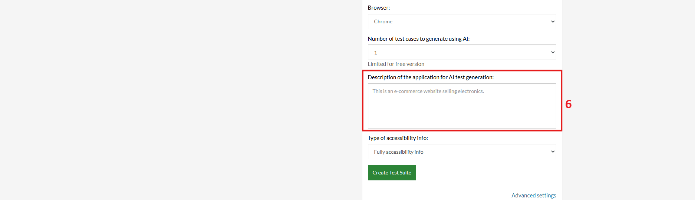
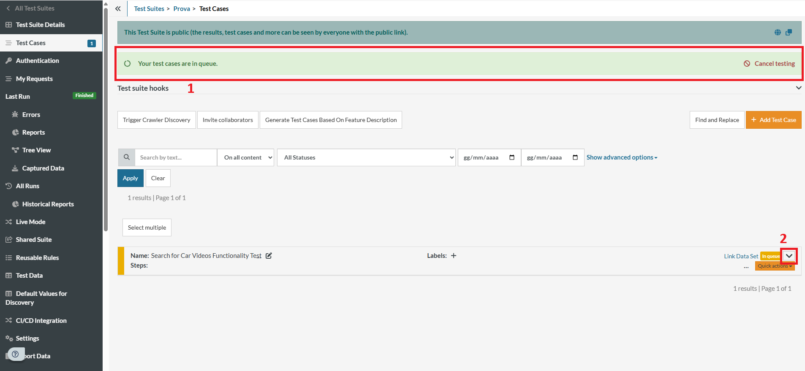
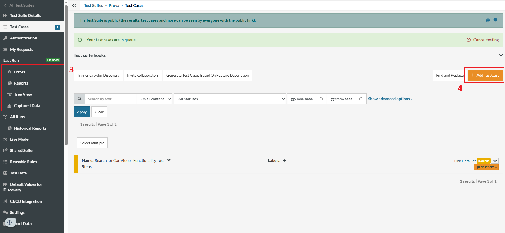

# Guida all'utilizzo di TestRigor

Questa breve guida descrive i passaggi per utilizzare **TestRigor** e creare test automatizzati partendo da linguaggio naturale.

## Registrazione e accesso

1. Vai sul sito [https://testrigor.com](https://testrigor.com).
2. Crea un account oppure accedi con un account esistente. (1)
> 

## Creazione di un nuovo progetto

3. Dopo l'accesso, Inserisci:
   - Nome del progetto. (2)
   - URL del sito da testare. (3)
   - Username e Password(opzionali). (4)
> 

4. Inserisci la descrizione del test che vuoi effettuare. (6)
> 
5. Infine crea la Test Suite.

## Esecuzione dei test

Una volta creata la Suite, il test partirà in automatico e puoi vedere il tempo stimato rimanente(1) e cosa precisamente sta facendo la macchina(2).
> 

Concluso il test, troverai eventuali errori premendo sul menu a sinistra(3). Inoltre, premendo su "Add Test Case" (4) puoi aggiungere altre istruzioni.
> 

### Conclusioni
- La *versione gratuita* di TestRigor è completa e permette di eseguire test senza troppe limitazioni.
- È uno strumento utile per crere test rapidamente, anche senza conoscenze di programmazione.
- Rispetto a framework come Cypress, è più immediamo ma meno personalizzabile.
