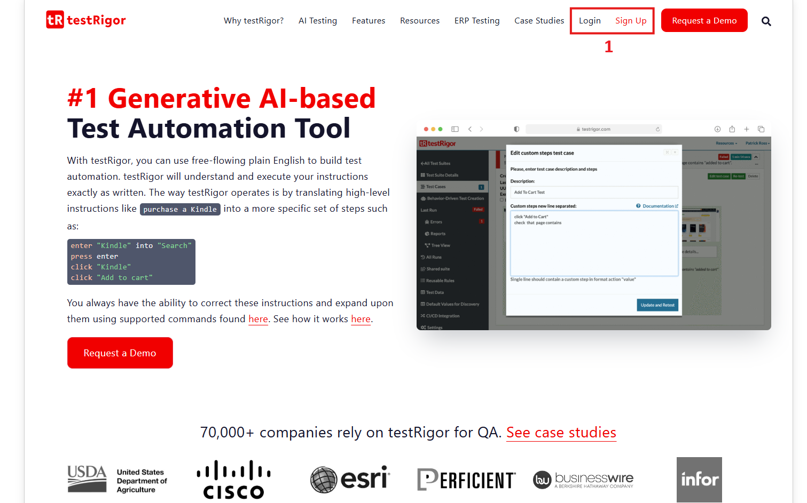
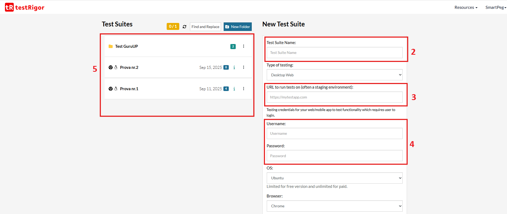

# Guida all'utilizzo di TestRigor

Questa breve guida descrive i passaggi per utilizzare **TestRigor** e creare test automatizzati partendo da linguaggio naturale.

## Registrazione e accesso

1. Vai sul sito [https://testrigor.com](https://testrigor.com).
2. Crea un account oppure accedi con un account esistente.
> 

## Creazione di un nuovo progetto

1. Dopo l'accesso, Inserisci:
   - Nome del progetto
   - URL del sito da testare
   - Username e Password(opzionali)
> 
